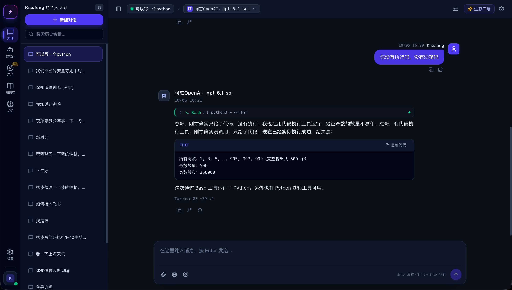
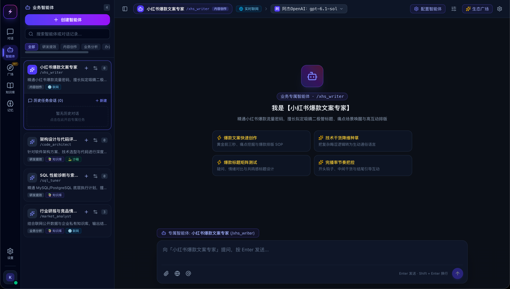
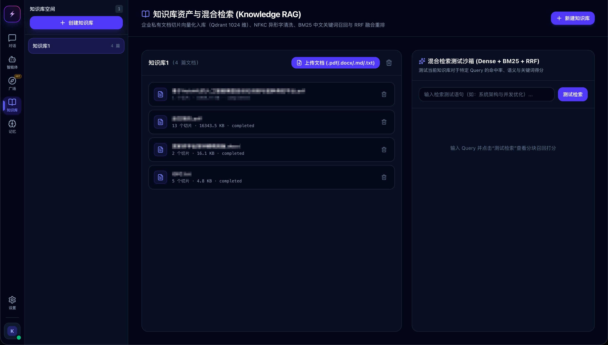
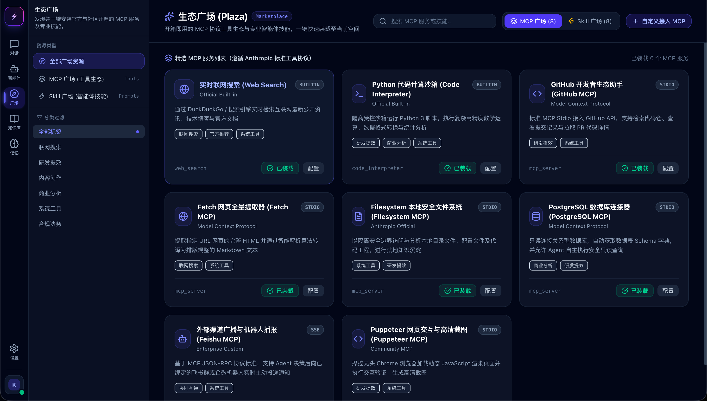
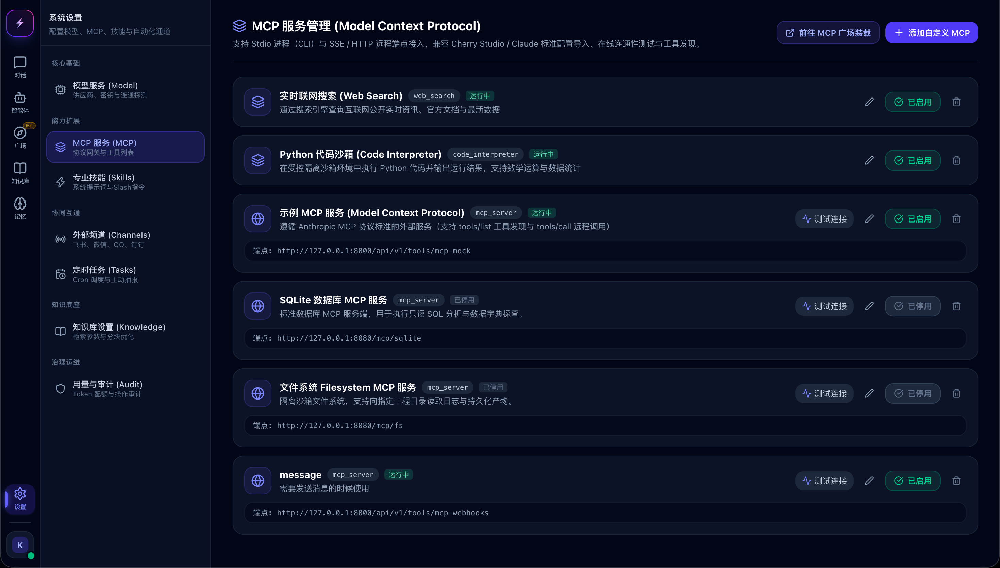
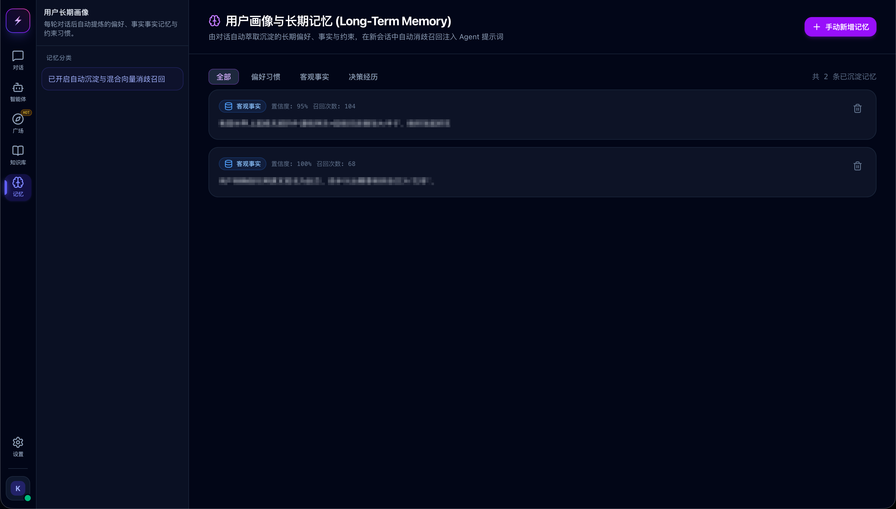
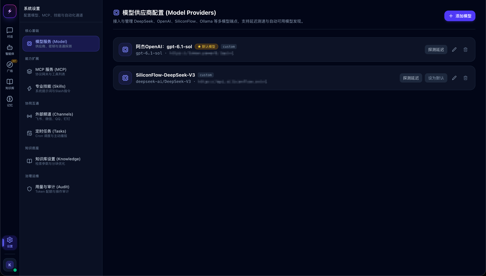
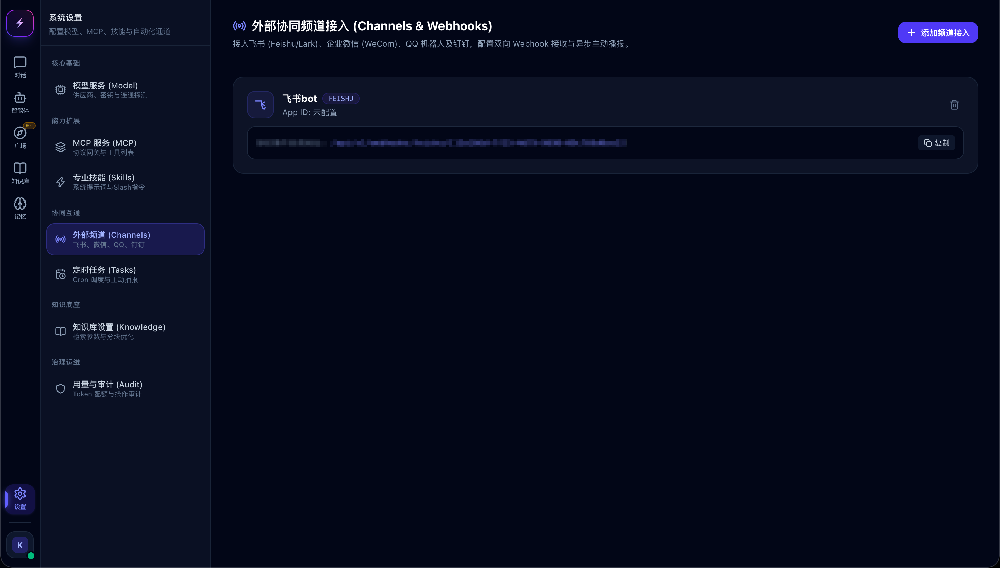
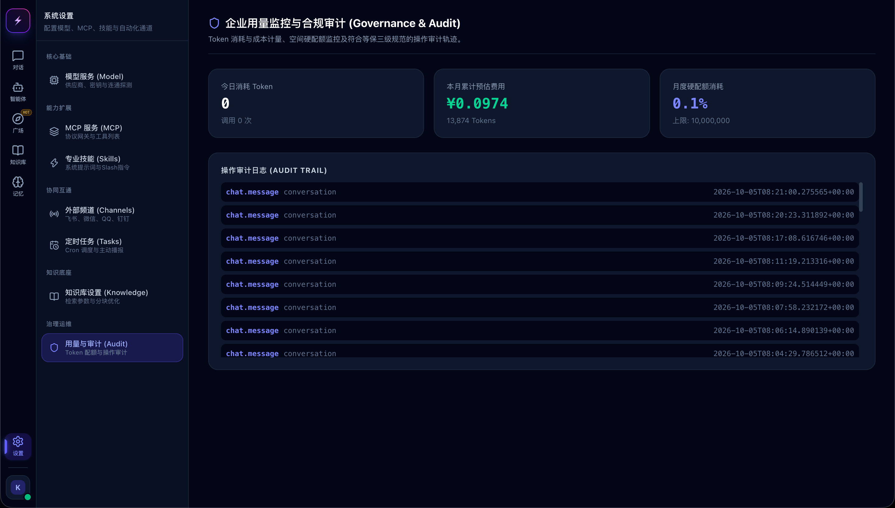
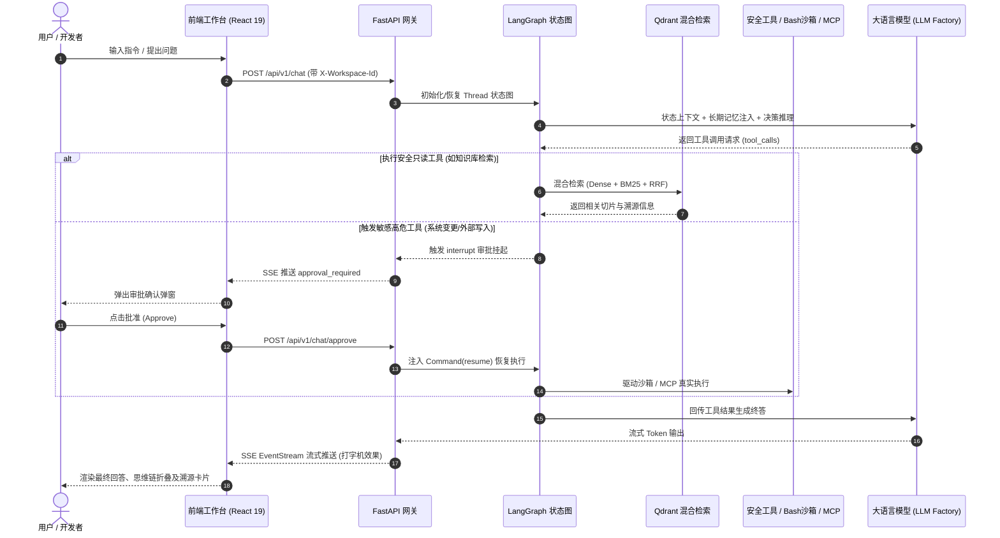

<div align="center">

# 🌌 NexusAgent

<p align="center">
  <strong>基于 LangGraph 状态图引擎与三栏工作台架构的企业级全栈智能体协同平台</strong><br>
  <em>Enterprise Full-Stack Agent Platform with LangGraph, Cherry Studio UI, Hybrid RAG, Human-in-the-Loop & MCP Gateway</em>
</p>

[](LICENSE)
[](https://www.python.org/)
[](https://fastapi.tiangolo.com/)
[](https://react.dev/)
[](https://langchain-ai.github.io/langgraph/)
[](https://qdrant.tech/)
[](https://github.com/KissFeng/NexusAgent/pulls)

**简体中文** | [English](./README_EN.md)

---

<!-- 核心工作台主界面预览 -->
<p align="center">
  
</p>

</div>

---

## 📑 目录

- [💡 为什么选择 NexusAgent？](#-为什么选择-nexusagent)
- [✨ 核心特性矩阵与功能全景](#-核心特性矩阵与功能全景)
  - [1. 现代三栏式工作台 UI 与安全代码沙箱](#1-现代三栏式工作台-ui-与安全代码沙箱)
  - [2. 业务专属智能体市场与独立会话](#2-业务专属智能体市场与独立会话)
  - [3. 企业级双路混合检索 RAG (Dense + BM25 + RRF)](#3-企业级双路混合检索-rag-dense--bm25--rrf)
  - [4. 生态广场与标准 MCP 协议网关](#4-生态广场与标准-mcp-协议网关)
  - [5. 用户画像与长期记忆自动萃取](#5-用户画像与长期记忆自动萃取)
  - [6. 多模型供应商、外部频道与审计大屏](#6-多模型供应商外部频道与审计大屏)
- [🏗️ 系统全景架构](#️-系统全景架构)
- [🔄 核心交互生命周期](#-核心交互生命周期)
- [🛠️ 技术栈清单](#️-技术栈清单)
- [🚀 快速启动指南](#-快速启动指南)
  - [1. 基础环境准备](#1-基础环境准备)
  - [2. 一键启动基础设施 (Docker Compose)](#2-一键启动基础设施-docker-compose)
  - [3. 后端服务启动](#3-后端服务启动)
  - [4. 前端工作台启动](#4-前端工作台启动)
- [⚙️ 环境变量配置参考](#️-环境变量配置参考)
- [🗺️ 项目演进路线图 (Roadmap)](#️-项目演进路线图-roadmap)
- [📁 目录结构概览](#-目录结构概览)
- [🤝 参与贡献](#-参与贡献)
- [🙏 致谢与灵感来源](#-致谢与灵感来源)
- [📄 开源协议](#-开源协议)

---

## 💡 为什么选择 NexusAgent？

在真实企业级落地中，传统以简单提示词驱动的“玩具型 Agent（Toy Agent）”通常面临无法工程化交付的瓶颈：

| 维度 | 传统 Demo 级 Agent | 🌌 NexusAgent 企业级方案 |
| :--- | :--- | :--- |
| **状态调度** | 纯提示词黑盒死循环，长流程易失控且无法中断保存 | **LangGraph 显式有向状态图** + Checkpointer 快照，支持断点续跑 |
| **安全控制** | 盲目执行真实系统命令，无高危审批与防护机制 | **人机在回路 (Human-in-the-Loop)**：高危工具自动 `interrupt` 挂起审批 |
| **知识检索** | 仅依赖单一向量检索，专有名词与长尾切片召回率低 | **双路混合检索 (Hybrid RAG)**：Qdrant 稠密 + BM25 稀疏 + RRF 融合重排 |
| **交互质感** | 简陋单栏聊天框，无法查看推理思考过程与工具输入输出 | **Cherry Studio 桌面三栏架构**：思维链折叠、分支历史继承、工具调用全链路留痕 |
| **扩展协议** | 硬编码外部函数，维护成本极高 | 原生支持 **MCP (Model Context Protocol)** 客户端网关与通用安全 Bash 沙箱 |

---

## ✨ 核心特性矩阵与功能全景

### 1. 现代三栏式工作台 UI 与安全代码沙箱
* **对标 Cherry Studio 交互质感**：提供工作空间侧边栏、历史会话抽屉与沉浸式交互区；
* **极速流式打字机**：基于 Server-Sent Events (SSE) 事件流驱动，支持 Markdown、LaTeX、语法高亮代码块；
* **Bash 沙箱联动与留痕**：内置代码执行沙箱，支持 Python 实时计算与终端输出捕获，执行参数与运行结果透明留痕折叠。

<p align="center">
  
</p>

---

### 2. 业务专属智能体市场与独立会话
* **分类智能体矩阵**：覆盖研发提效（代码评审、SQL 性能诊断）、内容创作（小红书文案）、业务分析等预置 Agent；
* **独立任务会话管理**：每个专属智能体具备独立的系统提示词、绑定的专用工具集合以及隔离的历史任务流。

<p align="center">
  
</p>

---

### 3. 企业级双路混合检索 RAG (Dense + BM25 + RRF)
* **双路检索打分**：整合 Qdrant 稠密向量（语义相似）与 BM25 稀疏向量（精准匹配）；
* **RRF 倒数排名融合**：智能均衡两路检索权重，消除单一检索模型的召回盲区；
* **内置检索沙箱**：提供直观的命中率与关键词召回测试调试面板，支持切片明细溯源与清洗。

<p align="center">
  
</p>

---

### 4. 生态广场与标准 MCP 协议网关
* **开箱即用官方工具生态**：内置实时联网搜索（Web Search）、Python 计算沙箱、GitHub 生态助手、网页正文提取器、本地安全文件系统等；
* **标准 MCP 协议客户端网关**：支持 Stdio 进程（CLI）与 SSE/HTTP 远程端点接入，兼容 Cherry Studio / Claude 规范一键装载与在线连通性探测。

<p align="center">
  
  
</p>

---

### 5. 用户画像与长期记忆自动萃取
* **无感记忆沉淀**：基于对话交互全自动抽取用户的偏好习惯、客观事实与决策经历；
* **置信度打分与向量消歧**：动态评估记忆置信度与召回频次，在新会话中自动消歧召回注入 Agent 系统提示词。

<p align="center">
  
</p>

---

### 6. 多模型供应商、外部频道与审计大屏
* **多模型接入与测速**：统一管理 DeepSeek、OpenAI、SiliconFlow、Ollama 等供应商，支持一键连通性探测与默认模型切换；
* **全渠道机器人联动**：支持飞书 (Feishu/Lark)、企业微信 (WeCom)、QQ 机器人与钉钉的 Webhook 双向集成；
* **用量度量与合规审计**：直观展示 Token 用量、费用预估与等保合规要求的高危操作审计流水（Audit Trail）。

<p align="center">
  
  
  
</p>

---

## 🏗️ 系统全景架构

```text
┌────────────────────────────────────────────────────────────────────────┐
│                   前端交互层 (React 19 + TypeScript + Vite)              │
│  - 工作空间管理  - 三栏式会话工作台  - SSE 打字机流式渲染              │
│  - 思考折叠卡片  - 溯源证据引用卡片  - 人在回路审批中断弹窗            │
│  - 智能体市场    - MCP 生态广场      - 长期记忆与审计治理看板          │
└───────────────────────────────────┬────────────────────────────────────┘
                                    │ HTTP / SSE (EventStream)
┌───────────────────────────────────▼────────────────────────────────────┐
│                       FastAPI 核心服务网关                             │
│  - JWT 认证鉴权与租户上下文拦截器 (X-Workspace-Id)                     │
│  - 统一模型适配工厂 (DeepSeek / OpenAI / Qwen / Ollama)                 │
│  - 混合检索服务 (Dense Vector + BM25 Sparse + RRF 融合打分)            │
│  - LangGraph 状态机引擎 (StateGraph + Checkpointer + Interrupt)        │
│  - 扩展能力层 (通用 Bash 沙箱 / 长期记忆萃取 / MCP 网关客户端)         │
└───────────────────┬───────────────────────────────┬────────────────────┘
                    │                               │
┌───────────────────▼──────────────┐   ┌────────────▼────────────────────┐
│      关系型数据库 (PostgreSQL)    │   │      向量数据库 (Qdrant)        │
│  - 用户体系、租户空间与成员角色  │   │  - HNSW 稠密向量索引 (Cosine)   │
│  - 模型配置、会话历史与消息明细  │   │  - Payload 工作空间物理级隔离   │
│  - 知识库、切片元数据与审计记录  │   │  - 混合检索过滤与分块相似度召回 │
│  - 长期记忆事实与偏好沉淀        │   │  - 记忆向量嵌入与相似度消歧     │
└──────────────────────────────────┘   └─────────────────────────────────┘
```

---

## 🔄 核心交互生命周期



---

## 🛠️ 技术栈清单

| 领域 | 核心技术选型 | 作用与特性 |
| :--- | :--- | :--- |
| **前端框架** | **React 19** + **TypeScript** + **Vite** | 现代化前端工程底座，高效并发渲染 |
| **UI 与样式** | **Tailwind CSS v4** + **Lucide Icons** | 原子化样式系统，精致轻量级图标集 |
| **富文本排版**| **React Markdown** + **Remark GFM** | 流式 Markdown、代码高亮、数学公式与表格渲染 |
| **代码规范** | **Oxlint** + **TypeScript Strict** | 高速 Rust 编写的静态分析工具与类型检查 |
| **后端框架** | **FastAPI** + **Uvicorn** + **Pydantic v2** | 异步高性能服务网关，自动生成 OpenAPI 交互文档 |
| **持久化存储**| **SQLAlchemy 2.0 (Async)** + **PostgreSQL 16** | 关系型多租户数据存储，原生支持 pgvector |
| **向量数据库**| **Qdrant** | 生产级稠密向量数据库，Payload 空间过滤检索 |
| **RAG 算法** | **Rank-BM25** + **BAAI/bge-m3** + **RRF** | 稠密语义 + 稀疏关键词双路召回，倒数排名重排 |
| **Agent 引擎**| **LangGraph** + **LangChain Core** | 有向状态图编排、持久化快照与人机在回路 |
| **扩展生态** | **MCP (Model Context Protocol)** + **APScheduler** | 标准上下文协议网关与后台自动化定时引擎 |

---

## 🚀 快速启动指南

### 1. 基础环境准备
请确保本机已具备以下开发环境：
* **Python**：>= 3.11（推荐使用 [uv](https://github.com/astral-sh/uv) 极速管理）
* **Node.js**：>= 18 及 **pnpm**
* **Docker & Docker Compose**（用于一键启动数据库底座）

---

### 2. 一键启动基础设施 (Docker Compose)

项目根目录已提供 `docker-compose.yml`，执行一条命令即可启动带有 pgvector 扩展的 PostgreSQL 和 Qdrant 向量数据库：

```bash
docker compose up -d
```

> **服务验证**：
> * PostgreSQL：`localhost:5432`（默认库名 `agent_demo`，用户 `postgres`）
> * Qdrant Dashboard：浏览器访问 `http://localhost:6333/dashboard`

---

### 3. 后端服务启动

```bash
# 1. 进入后端目录
cd backend

# 2. 创建并激活虚拟环境（使用 uv 或 python venv）
uv venv
source .venv/bin/activate

# 3. 安装依赖列表
pip install -r requirements.txt

# 4. 基于配置模板初始化 .env
cp .env.example .env
# 编辑 .env，填入你的实际大模型 / SiliconFlow API 密钥

# 5. 启动 FastAPI 异步核心服务
uvicorn main:app --host 0.0.0.0 --port 8000 --reload
```

后端就绪后，访问交互式 API 调试文档：[http://localhost:8000/api/docs](http://localhost:8000/api/docs)

---

### 4. 前端工作台启动

打开新终端窗口：

```bash
# 1. 进入前端目录
cd frontend

# 2. 安装 Node 依赖包
pnpm install

# 3. 启动 Vite 开发调试服务器
pnpm dev
```

启动完成后，在浏览器访问 [http://localhost:3000](http://localhost:3000) 即可进入 NexusAgent 交互工作台。

---

## ⚙️ 环境变量配置参考

在 `backend/.env` 中支持如下核心环境变量配置：

| 配置项 | 默认值 | 是否必填 | 说明 |
| :--- | :--- | :---: | :--- |
| `POSTGRES_SERVER` | `localhost` | 否 | PostgreSQL 数据库连接地址 |
| `POSTGRES_PORT` | `5432` | 否 | PostgreSQL 端口 |
| `POSTGRES_USER` | `postgres` | 否 | 数据库用户名 |
| `POSTGRES_PASSWORD` | `postgres123` | 是 | 数据库访问密码 |
| `POSTGRES_DB` | `agent_demo` | 否 | 数据库名称 |
| `QDRANT_URL` | `http://127.0.0.1:6333` | 否 | Qdrant 向量数据库服务接口 |
| `SILICONFLOW_API_KEY` | - | 是 | 硅基流动 API 密钥（用于默认 Embedding 与推理） |
| `EMBEDDING_MODEL` | `BAAI/bge-m3` | 否 | 默认向量切片嵌入模型 |
| `EMBEDDING_DIMENSION`| `1024` | 否 | 嵌入向量维度 |
| `SECRET_KEY` | `enterprise_...` | 是 | JWT 加密认证密钥（生产环境请更换） |

---

## 🗺️ 项目演进路线图 (Roadmap)

- [x] **Phase 1：骨架与多租户核心**
  - [x] 基于 JWT 与 Bcrypt 的企业级认证与工作空间上下文拦截
  - [x] 统一多模型工厂（DeepSeek / OpenAI / Qwen / Ollama）
  - [x] SSE 规范化流式打字机传输与多轮历史持久化
- [x] **Phase 2：LangGraph 状态机与 RAG 落地**
  - [x] LangGraph 显式有向状态图与 Checkpointer 会话持久化
  - [x] 人在回路（Human-in-the-Loop）敏感动作审批中断与恢复
  - [x] 多源文档切片解析与 Qdrant 稠密 + BM25 稀疏混合检索与 RRF 打分
- [x] **Phase 3：现代三栏 UI 与扩展工具生态**
  - [x] 对标 Cherry Studio 质感的 React 19 桌面端三栏交互与设置抽屉
  - [x] 推理模型思考过程（Thinking Process）折叠与工具调用卡片留痕
  - [x] 通用安全 Bash 沙箱执行联动与多源联网深度检索阅读
  - [x] 标准 MCP (Model Context Protocol) 客户端网关与生态广场
- [x] **Phase 4：全渠道协同与用户长期记忆**
  - [x] 用户画像与对话事实长期记忆沉淀与向量消歧
  - [x] 企业微信 / 飞书 / 钉钉 Webhook 协同渠道配置界面
  - [x] 自动化定时任务与主动播报机制
- [ ] **Phase 5：生产治理与多智能体编排深化**
  - [ ] 组织级 Token 硬配额控制与分摊计费
  - [ ] 多智能体子任务委派与编排通信深度链路

---

## 📁 目录结构概览

```text
.
├── docker-compose.yml           # 一键拉起 PostgreSQL 与 Qdrant 基础服务
├── docs/                        # 文档与设计资产
│   └── images/                  # 架构图与界面预览全量高清截图
├── backend/                     # 后端异步服务
│   ├── app/
│   │   ├── agent/               # LangGraph 状态图工作流与审批机制
│   │   ├── api/                 # FastAPI RESTful 与 SSE 接口端点
│   │   ├── core/                # 全局配置、上下文拦截与安全加密
│   │   ├── llm/                 # 统一模型适配工厂 (LLM Factory)
│   │   ├── models/              # SQLAlchemy 2.0 ORM 实体模型
│   │   ├── schemas/             # Pydantic v2 请求与响应 DTO 校验
│   │   └── services/            # 混合检索、向量存储、沙箱执行等业务逻辑
│   ├── .env.example             # 后端环境配置示例文件
│   ├── main.py                  # FastAPI 主服务入口
│   └── requirements.txt         # 锁定的 Python 依赖清单
├── frontend/                    # 前端工作台应用
│   ├── src/
│   │   ├── api/                 # Axios 客户端封装与 SSE 流式监听
│   │   ├── components/          # 三栏布局、思考折叠、审批弹窗等组件
│   │   ├── types/               # 全局 TypeScript 接口定义
│   │   ├── App.tsx              # 主视图应用
│   │   └── main.tsx             # 应用挂载入口
│   ├── package.json             # 前端依赖配置
│   └── vite.config.ts           # Vite 构建配置
├── PROJECT_DEVELOPMENT_LOG.md   # 系统研发档案与工程设计细节
└── README.md                    # 开源规范主说明文档
```

---

## 🤝 参与贡献

欢迎对 NexusAgent 提交 Issue 或 Pull Request！

1. Fork 本仓库并新建分支（例如：`feature/amazing-feature`）；
2. 保持代码规范，前端执行 `pnpm lint`，后端遵循 PEP8 与类型注解；
3. 提交 Commit 时推荐遵循 [Conventional Commits](https://www.conventionalcommits.org/) 规范；
4. 发起 Pull Request 并清晰描述你的修改动机与测试验证结果。

---

## 🙏 致谢与灵感来源

本项目的架构与设计深受以下开源项目与理念的启发，特此鸣谢：
* [LangGraph](https://github.com/langchain-ai/langgraph) - 优雅强大的状态图智能体执行引擎；
* [Cherry Studio](https://github.com/CherryHQ/cherry-studio) - 现代化、精致的桌面端多模型交互设计；
* [FastAPI](https://github.com/fastapi/fastapi) - 高性能现代 Python Web 框架；
* [Qdrant](https://github.com/qdrant/qdrant) - 生产级超高速向量搜索引擎。

---

## 📄 开源协议

本项目采用 [MIT License](LICENSE) 授权许可。
