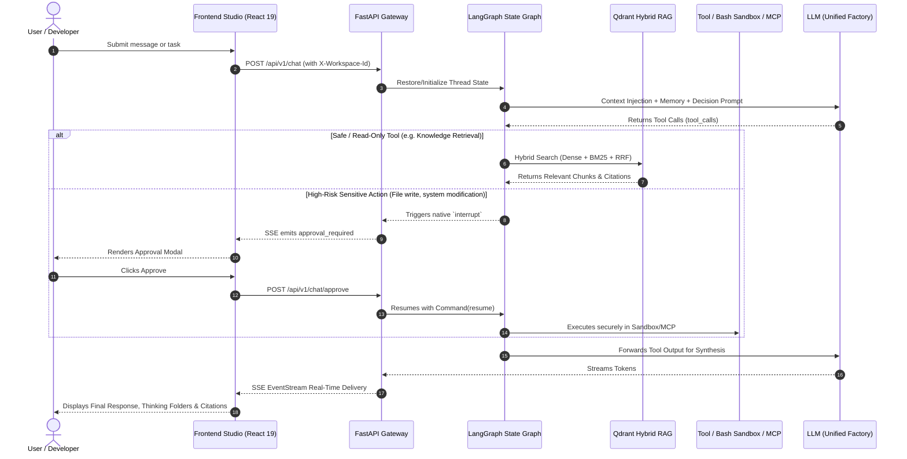

<div align="center">

# 🌌 NexusAgent

<p align="center">
  <strong>Enterprise Full-Stack Collaborative Agent Platform Powered by LangGraph State Graph Engine & Modern Three-Column Studio Architecture</strong><br>
  <em>LangGraph Orchestration · Cherry Studio-Inspired UI · Hybrid RAG (Dense + BM25 + RRF) · Human-in-the-Loop · MCP Gateway</em>
</p>

[](LICENSE)
[](https://www.python.org/)
[](https://fastapi.tiangolo.com/)
[](https://react.dev/)
[](https://langchain-ai.github.io/langgraph/)
[](https://qdrant.tech/)
[](https://github.com/KissFeng/NexusAgent/pulls)

[简体中文](./README.md) | **English**

---

<!-- Main Studio Preview -->
<p align="center">
  
</p>

</div>

---

## 📑 Table of Contents

- [💡 Why NexusAgent?](#-why-nexusagent)
- [✨ Core Features & Capabilities](#-core-features--capabilities)
  - [1. Modern Three-Column Studio UI & Code Sandbox](#1-modern-three-column-studio-ui--code-sandbox)
  - [2. Specialized Agent Marketplace & Dedicated Sessions](#2-specialized-agent-marketplace--dedicated-sessions)
  - [3. Enterprise Hybrid Retrieval RAG (Dense + BM25 + RRF)](#3-enterprise-hybrid-retrieval-rag-dense--bm25--rrf)
  - [4. Plugin Plaza & Standard MCP Protocol Gateway](#4-plugin-plaza--standard-mcp-protocol-gateway)
  - [5. User Profiling & Automated Long-Term Memory Extraction](#5-user-profiling--automated-long-term-memory-extraction)
  - [6. Multi-LLM Providers, External Channels & Audit Trail](#6-multi-llm-providers-external-channels--audit-trail)
- [🏗️ System Architecture](#️-system-architecture)
- [🔄 Core Interaction Lifecycle](#-core-interaction-lifecycle)
- [🛠️ Tech Stack](#️-tech-stack)
- [🚀 Quick Start Guide](#-quick-start-guide)
  - [1. Prerequisites](#1-prerequisites)
  - [2. One-Click Infrastructure Setup (Docker Compose)](#2-one-click-infrastructure-setup-docker-compose)
  - [3. Backend Setup](#3-backend-setup)
  - [4. Frontend Setup](#4-frontend-setup)
- [⚙️ Configuration Reference](#️-configuration-reference)
- [🗺️ Roadmap](#️-roadmap)
- [📁 Directory Structure](#-directory-structure)
- [🤝 Contributing](#-contributing)
- [🙏 Acknowledgements](#-acknowledgements)
- [📄 License](#-license)

---

## 💡 Why NexusAgent?

In real-world enterprise environments, traditional prompt-driven "toy agents" often struggle with production readiness:

| Dimension | Traditional Toy Agents | 🌌 NexusAgent Solution |
| :--- | :--- | :--- |
| **State Scheduling** | Black-box loops prone to infinite runs, state loss, and lack of resumption | **LangGraph Directed State Graph** + Checkpointer snapshots for seamless resumption |
| **Safety & Control** | Blind execution of arbitrary commands without safety verification | **Human-in-the-Loop (HITL)**: Automatic `interrupt` pauses for dangerous tools |
| **Retrieval Quality**| Single dense vector search with poor recall on domain keywords and IDs | **Hybrid RAG**: Qdrant Dense + BM25 Sparse + Reciprocal Rank Fusion (RRF) |
| **User Experience**  | Primitive single-column chat without visibility into thinking chains | **Cherry Studio-Inspired Three-Column UI**: Foldable thinking process, branch history & audit cards |
| **Tool Extensibility**| Tightly coupled custom function calls | Native **Model Context Protocol (MCP)** gateway client & secure Bash sandbox |

---

## ✨ Core Features & Capabilities

### 1. Modern Three-Column Studio UI & Code Sandbox
* **Cherry Studio-Grade Interaction**: Workspace switching, session navigation drawers, and an immersive primary chat canvas.
* **Ultra-Fast Streaming**: SSE (Server-Sent Events) event-stream rendering with full Markdown, LaTeX formulas, and syntax-highlighted code blocks.
* **Bash Sandbox & Execution Traceability**: Built-in isolated command execution supporting real-time Python execution, input/output inspection, and token usage accounting.

<p align="center">
  
</p>

---

### 2. Specialized Agent Marketplace & Dedicated Sessions
* **Curated Agent Profiles**: Out-of-the-box agents for engineering (code review, SQL tuning), creative copy, and market intelligence.
* **Isolated Task Sessions**: Dedicated system prompts, custom-bound tool sets, and compartmentalized conversation histories for each agent.

<p align="center">
  
</p>

---

### 3. Enterprise Hybrid Retrieval RAG (Dense + BM25 + RRF)
* **Dual-Channel Scoring**: Fuses Qdrant dense vector semantic similarity with BM25 sparse keyword precision.
* **Reciprocal Rank Fusion (RRF)**: Balances differing scoring distributions to eliminate retrieval blind spots.
* **Interactive Retrieval Sandbox**: Live recall testing console with granular similarity inspection and citation rendering.

<p align="center">
  
</p>

---

### 4. Plugin Plaza & Standard MCP Protocol Gateway
* **Built-in Ecosystem Tools**: Native support for live web search, Python interpreter sandbox, GitHub ecosystem integration, and local filesystem access.
* **Standard MCP Gateway Client**: Connects via Stdio CLI processes or SSE/HTTP endpoints, compatible with Claude and Cherry Studio configurations.

<p align="center">
  
  
</p>

---

### 5. User Profiling & Automated Long-Term Memory Extraction
* **Autonomous Memory Distillation**: Seamlessly captures user preferences, facts, and past decisions across conversation turns.
* **Confidence Scoring & Disambiguation**: Vector-based memory retrieval automatically injects high-confidence context into future sessions.

<p align="center">
  
</p>

---

### 6. Multi-LLM Providers, External Channels & Audit Trail
* **Multi-Provider Factory**: Unified management of DeepSeek, OpenAI, SiliconFlow, Ollama, and custom endpoints with latency probes.
* **Omnichannel Webhook Integration**: Bidirectional webhook bridges for Feishu/Lark, WeChat Work (WeCom), QQ Bot, and DingTalk.
* **Governance & Audit Trail**: Real-time token consumption metrics, expense estimators, and security audit logs.

<p align="center">
  
  
  
</p>

---

## 🏗️ System Architecture

```text
┌────────────────────────────────────────────────────────────────────────┐
│               Frontend Interaction Layer (React 19 + Vite + TS)        │
│  - Workspace Management  - Three-Column Canvas  - SSE Streaming Chat   │
│  - Thinking Folders     - Citation Badges      - HITL Approval Dialog  │
│  - Agent Marketplace     - MCP Plaza            - Audit Dashboards      │
└───────────────────────────────────┬────────────────────────────────────┘
                                    │ HTTP / SSE (EventStream)
┌───────────────────────────────────▼────────────────────────────────────┐
│                       FastAPI Core Service Gateway                     │
│  - JWT Authentication & Tenant Context Interceptor (X-Workspace-Id)    │
│  - Unified LLM Factory (DeepSeek / OpenAI / Qwen / Ollama)             │
│  - Hybrid Search Engine (Dense Vector + BM25 Sparse + RRF Re-ranking)  │
│  - LangGraph State Machine (StateGraph + Checkpointer + Interrupt)     │
│  - Extensible Tooling (Bash Sandbox / Memory Extraction / MCP Client)  │
└───────────────────┬───────────────────────────────┬────────────────────┘
                    │                               │
┌───────────────────▼──────────────┐   ┌────────────▼────────────────────┐
│       Relational DB (PostgreSQL) │   │        Vector DB (Qdrant)       │
│  - Users, Workspaces, Members    │   │  - HNSW Dense Vectors (Cosine)  │
│  - Models, Chats, Message Logs   │   │  - Workspace Payload Isolation  │
│  - Knowledge Bases & Citations   │   │  - Multi-Collection Similarity  │
│  - Long-Term Fact Distillations  │   │  - Memory Embedding Space       │
└──────────────────────────────────┘   └─────────────────────────────────┘
```

---

## 🔄 Core Interaction Lifecycle



---

## 🛠️ Tech Stack

| Domain | Core Technologies | Details |
| :--- | :--- | :--- |
| **Frontend Framework** | **React 19** + **TypeScript** + **Vite** | Modern, high-performance concurrent client architecture |
| **UI & Styling** | **Tailwind CSS v4** + **Lucide Icons** | Utility-first styling with sleek modern iconography |
| **Markdown & Formatting**| **React Markdown** + **Remark GFM** | Streaming Markdown, math formulas, syntax-highlighted code |
| **Code Linting** | **Oxlint** + **TypeScript Strict** | Blazing-fast Rust-based static analysis and strict types |
| **Backend Framework** | **FastAPI** + **Uvicorn** + **Pydantic v2** | High-concurrency async Python framework with auto OpenAPI |
| **Relational Storage**| **SQLAlchemy 2.0 (Async)** + **PostgreSQL 16** | Multi-tenant async ORM with native pgvector capability |
| **Vector Database** | **Qdrant** | Production-ready high-performance vector search engine |
| **RAG Algorithms** | **Rank-BM25** + **BAAI/bge-m3** + **RRF** | Hybrid dense & sparse search fused by Reciprocal Rank Fusion |
| **Agent Engine** | **LangGraph** + **LangChain Core** | Directed state graphs, checkpoints, and human approvals |
| **Tool Protocols** | **MCP (Model Context Protocol)** + **APScheduler** | Standard client gateway & background task scheduling |

---

## 🚀 Quick Start Guide

### 1. Prerequisites
Ensure your environment meets the following requirements:
* **Python**: >= 3.11 (Recommended: [uv](https://github.com/astral-sh/uv))
* **Node.js**: >= 18 with **pnpm**
* **Docker & Docker Compose** (for one-click infrastructure)

---

### 2. One-Click Infrastructure Setup (Docker Compose)

Launch PostgreSQL (with pgvector) and Qdrant vector database via the root `docker-compose.yml`:

```bash
docker compose up -d
```

> **Verify Services**:
> * PostgreSQL: `localhost:5432` (Default database: `agent_demo`, User: `postgres`)
> * Qdrant Dashboard: Open `http://localhost:6333/dashboard`

---

### 3. Backend Setup

```bash
# 1. Navigate to the backend directory
cd backend

# 2. Create and activate a virtual environment
uv venv
source .venv/bin/activate

# 3. Install Python dependencies
pip install -r requirements.txt

# 4. Initialize environment configuration
cp .env.example .env
# Edit .env and supply your database credentials & SiliconFlow API key

# 5. Start the FastAPI application
uvicorn main:app --host 0.0.0.0 --port 8000 --reload
```

Interactive API documentation will be available at: [http://localhost:8000/api/docs](http://localhost:8000/api/docs)

---

### 4. Frontend Setup

In a new terminal window:

```bash
# 1. Navigate to the frontend directory
cd frontend

# 2. Install dependencies
pnpm install

# 3. Start Vite development server
pnpm dev
```

Open your browser at [http://localhost:3000](http://localhost:3000) to access the NexusAgent Studio.

---

## ⚙️ Configuration Reference

Supported environment variables in `backend/.env`:

| Key | Default | Required | Description |
| :--- | :--- | :---: | :--- |
| `POSTGRES_SERVER` | `localhost` | No | PostgreSQL host address |
| `POSTGRES_PORT` | `5432` | No | PostgreSQL port |
| `POSTGRES_USER` | `postgres` | No | Database username |
| `POSTGRES_PASSWORD` | `postgres123` | Yes | Database password |
| `POSTGRES_DB` | `agent_demo` | No | Database name |
| `QDRANT_URL` | `http://127.0.0.1:6333` | No | Qdrant vector database endpoint |
| `SILICONFLOW_API_KEY` | - | Yes | SiliconFlow API Key (for embeddings & default models) |
| `EMBEDDING_MODEL` | `BAAI/bge-m3` | No | Default embedding model |
| `EMBEDDING_DIMENSION`| `1024` | No | Embedding vector dimension |
| `SECRET_KEY` | `enterprise_...` | Yes | JWT secret key (replace in production) |

---

## 🗺️ Roadmap

- [x] **Phase 1: Core Foundation & Multi-Tenancy**
  - [x] JWT & Bcrypt authentication with tenant context interceptor
  - [x] Unified model factory (DeepSeek / OpenAI / Qwen / Ollama)
  - [x] Standardized SSE typing output with multi-turn persistence
- [x] **Phase 2: LangGraph State Machine & RAG**
  - [x] LangGraph directed state graphs with Checkpointer snapshots
  - [x] Human-in-the-Loop sensitive action interruption and resumption
  - [x] Multi-source document chunking, Qdrant + BM25 Hybrid RAG & RRF
- [x] **Phase 3: Modern UI & Extensible Tools**
  - [x] Cherry Studio-grade React 19 three-column interface
  - [x] Reasoning model thinking process folding and tool audit cards
  - [x] General Bash sandbox execution & deep web search reader
  - [x] Model Context Protocol (MCP) client gateway & tool plaza
- [x] **Phase 4: Omnichannel Integration & Long-Term Memory**
  - [x] Autonomous user fact/preference extraction and vector disambiguation
  - [x] Feishu/Lark, WeChat Work, QQ Bot & DingTalk webhook panels
  - [x] Scheduled automated task executions and proactive broadcasting
- [ ] **Phase 5: Enterprise Governance & Multi-Agent Teams**
  - [ ] Organization-level token budgeting and billing allocation
  - [ ] Multi-agent sub-delegation orchestration and inter-agent communication

---

## 📁 Directory Structure

```text
.
├── docker-compose.yml           # PostgreSQL & Qdrant one-click setup
├── docs/                        # Documentation and media assets
│   └── images/                  # Full-resolution screenshots
├── backend/                     # Async backend service
│   ├── app/
│   │   ├── agent/               # LangGraph workflows and approval nodes
│   │   ├── api/                 # FastAPI REST and SSE endpoints
│   │   ├── core/                # Configuration and security interceptors
│   │   ├── llm/                 # Unified LLM factory
│   │   ├── models/              # SQLAlchemy ORM models
│   │   ├── schemas/             # Pydantic v2 schemas and DTOs
│   │   └── services/            # Hybrid search, vector store, sandbox services
│   ├── .env.example             # Configuration template
│   ├── main.py                  # Backend application entry point
│   └── requirements.txt         # Pinned Python dependencies
├── frontend/                    # Modern React frontend application
│   ├── src/
│   │   ├── api/                 # Axios HTTP & SSE event handlers
│   │   ├── components/          # Studio layout, modals, drawers
│   │   ├── types/               # TypeScript definitions
│   │   ├── App.tsx              # Main application view
│   │   └── main.tsx             # Frontend mount point
│   ├── package.json             # NPM dependencies
│   └── vite.config.ts           # Vite bundler configuration
├── PROJECT_DEVELOPMENT_LOG.md   # Detailed engineering development log
├── README_EN.md                 # English documentation
└── README.md                    # Chinese documentation
```

---

## 🤝 Contributing

Contributions to NexusAgent are warmly welcomed!

1. Fork this repository and create your feature branch (`git checkout -b feature/amazing-feature`);
2. Adhere to code conventions (`pnpm lint` for frontend, PEP8 and type annotations for backend);
3. Follow [Conventional Commits](https://www.conventionalcommits.org/);
4. Submit a Pull Request with a clear description of changes.

---

## 🙏 Acknowledgements

NexusAgent is inspired by and built upon fantastic open-source projects:
* [LangGraph](https://github.com/langchain-ai/langgraph) - Flexible and powerful state graph agent engine;
* [Cherry Studio](https://github.com/CherryHQ/cherry-studio) - Sleek, modern desktop AI multi-model experience;
* [FastAPI](https://github.com/fastapi/fastapi) - High-performance modern Python web framework;
* [Qdrant](https://github.com/qdrant/qdrant) - High-performance vector database.

---

## 📄 License

This project is licensed under the [MIT License](LICENSE).
